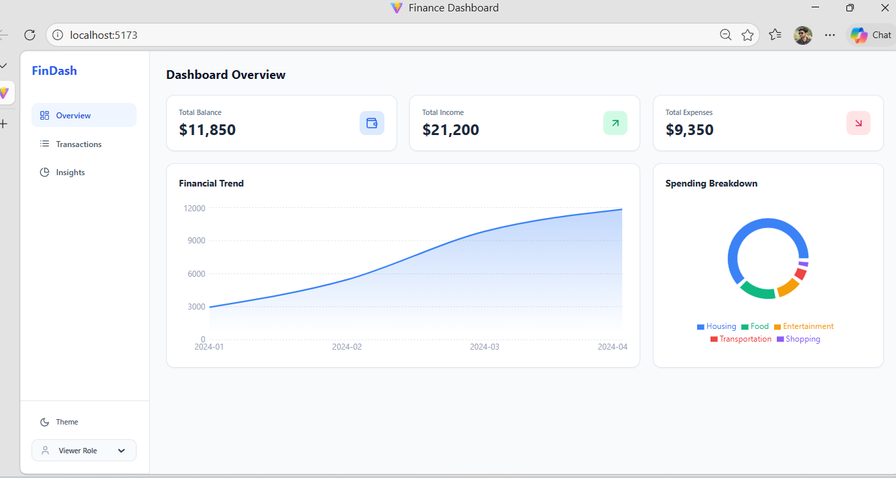
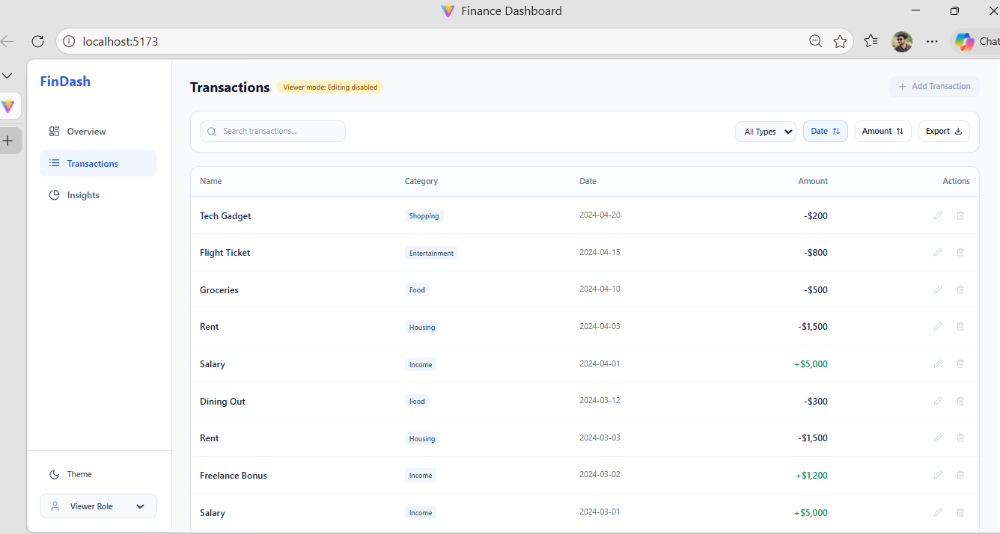
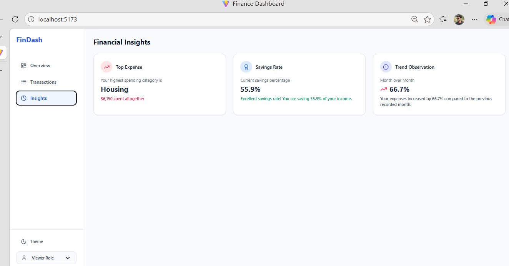

# Finance Dashboard UI

This project is a finance dashboard web application that allows users to track income, expenses, and financial insights through an intuitive interface. It is built as a Single Page Application (SPA) using React and focuses on clean UI, state management, and user experience.

## Features

### 📊 Dashboard Overview
- Total Balance, Income, Expenses
- Spending Breakdown (Pie Chart)
- Financial Trends (Area Chart)

### 💳 Transactions Management
- View all transactions
- Search, filter (Income/Expense)
- Sort by Date or Amount
- Add, edit, delete (Admin)
- Export to CSV

### 📈 Insights
- Highest spending category
- Savings rate
- Monthly comparison

### 🔐 Role-Based UI
- Viewer: Read-only access
- Admin: Full access (Add/Edit/Delete)

### 🎨 UI/UX
- Responsive design
- Dark & Light mode

## Tech Stack
- React (Vite)
- Tailwind CSS
- Recharts
- Lucide React
- Local Storage

## How It Works

- The app loads mock transaction data initially
- All data is managed using React Context API
- User actions (add/edit/delete/filter) update global state
- Components automatically re-render based on state changes
- Data is persisted using localStorage

## 📸 Screenshots

### Dashboard


### Transactions


### Insights


## Edge Cases Handled

- Handles empty transaction list
- Prevents invalid inputs
- Viewer cannot modify data
- Data persists after refresh

## Setup Instructions

1. Ensure you have Node.js installed.
2. Navigate to the project directory:
   ```bash
   cd finance-dashboard
   ```
3. Install dependencies:
   ```bash
   npm install
   ```
4. Start the development server:
   ```bash
   npm run dev
   ```

## Note on Architecture & State Management

The application is structured tightly with modular components and a centralized State Manager (`FinanceContext.jsx`). The Context API is responsible for lifting the state up so it can be gracefully consumed by `Overview`, `Transactions`, and `Insights` without prop drilling. 
Additionally, mock data has been configured to establish an initial context so that the dashboard doesn't initialize empty.
CSS native animations mapping through Tailwind handles all micro-interactions seamlessly without the bulky overhead of libraries such as Framer Motion.

## Evaluation Criteria Satisfied
1. **Design**: Modern, clean structure with glassmorphic hints and smooth transitions via Tailwind `animate-in`.
2. **Responsiveness**: All containers, Sidebars, and Charts resize dynamically.
3. **Functionality**: Complete filtering, sorting, insights, and RBAC included.
4. **UX**: Interactions provide instant feedback. Modals handle create/edit seamlessly. Easy to navigate interface.
